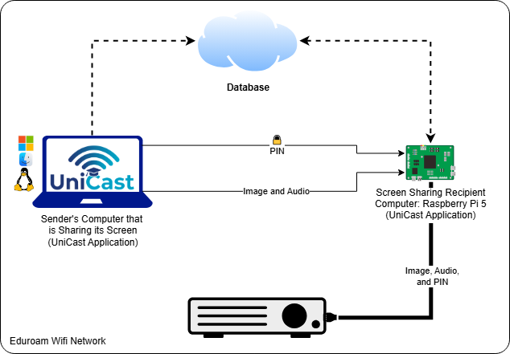

<div align="right">
  <a href="README_TR.md">Türkçe</a>
</div>

<div align="center">
  
  <h1>UniCast</h1>
  <p><strong>Low-latency wireless screen mirroring for education</strong></p>
  <p>
    <a href="https://github.com/alku-unicast/core/actions/workflows/build.yml">
      
    </a>
    
    
    <a href="https://github.com/alku-unicast/core/releases/latest">
      
    </a>
  </p>
  
</div>

---

## Platform Support

UniCast supports **Windows, Linux, and macOS**. However, macOS support is currently partial — fullscreen streaming works fully, but two features are disabled for this release:

| Feature | Windows | Linux | macOS |
|---------|:-------:|:-----:|:-----:|
| Fullscreen streaming | Yes | Yes | Yes |
| Window capture mode | Yes | Yes | WIP |
| Audio streaming | Yes | Yes | WIP |
| Hardware acceleration | Yes — NVENC / QSV / AMF | Yes — VAAPI | Yes — VideoToolbox |
| Streaming overlay bar | Yes | Yes | Yes *(off by default)* |
| Screen Recording permission required | — | — | Yes |

> **macOS — Why are window capture and audio disabled?**
>
> - **Window capture:** `AVFoundation` (avfvideosrc) captures at Retina physical resolution. Mapping logical window coordinates from `CGWindowList` to physical-pixel crop values works for static windows, but tracking a moving window during a live stream requires dynamic pipeline updates — not yet implemented.
> - **Audio:** macOS does not expose a system audio loopback API without a virtual audio device (e.g., BlackHole). Routing audio through a third-party driver introduces sync issues unsuitable for a classroom setting. A native CoreAudio loopback solution is planned.
>
> Both features are planned for a future release. Until then, the UI hides these options on macOS.

---

## About

UniCast is an open-source wireless screen mirroring system designed for classrooms. A teacher connects their laptop to a projector over **Wi-Fi or LAN** — no cables, no dongles, no driver installations.

- **Sender:** The UniCast desktop app (Windows / Linux / macOS) captures the screen and streams it over UDP
- **Receiver:** A Raspberry Pi 5 connected to the projector via HDMI decodes the stream in real time

UniCast is built with [Tauri](https://tauri.app/) (Rust backend + React frontend) and [GStreamer](https://gstreamer.freedesktop.org/) for the media pipeline.

---

## Features

| Feature | Details |
|---------|---------|
| **Low Latency** | < 150 ms end-to-end over LAN |
| **Cross-Platform** | Windows 10/11, Linux (X11/Wayland), macOS (Intel + Apple Silicon) |
| **Hardware Acceleration** | NVIDIA (NVENC), Intel (QSV), AMD (AMF), Apple (VideoToolbox), CPU fallback |
| **Audio Streaming** | Opus audio via UDP with volume control *(Windows & Linux; macOS: WIP)* |
| **PIN Authentication** | Time-limited PIN shown on the projector screen |
| **Session Token Security** | All control commands require a signed session token |
| **Streaming Overlay Bar** | Floating always-on-top bar during stream (timer, network quality, stop) |
| **Room Discovery** | Firebase-backed room list with offline caching |
| **Favorites & Floor Filter** | Quick access to frequently used rooms |
| **Manual Connection** | Connect directly by IP if Firebase is unreachable |
| **Network Quality Monitor** | Real-time RTT indicator (excellent / good / degraded / poor) |

---

## Download

> GStreamer is bundled — **no separate installation required**.

| Platform | Download |
|----------|----------|
| Windows 10/11 (x64) | [UniCast-Setup.exe](https://github.com/alku-unicast/core/releases/download/v0.1.0/UniCast_0.1.0_x64-setup.exe) |
| Linux (x86_64 AppImage) | [UniCast.AppImage](https://github.com/alku-unicast/core/releases/download/v0.1.0/UniCast_0.1.0_amd64.AppImage) |
| macOS (ARM64 / Intel) | [UniCast.dmg](https://github.com/alku-unicast/core/releases/download/v0.1.0/UniCast_0.1.0_aarch64.dmg) |

All releases: [github.com/alku-unicast/core/releases](https://github.com/alku-unicast/core/releases)

---

### Windows

Run the installer (`UniCast_x64-setup.exe`) and follow the prompts. No additional steps required.

---

### Linux

The AppImage bundles GStreamer — no system packages needed.

```bash
# 1. Make executable
chmod +x UniCast_0.1.0_amd64.AppImage

# 2. Run
./UniCast_0.1.0_amd64.AppImage
```

> **Wayland users:** UniCast auto-detects the display server. Window capture falls back to fullscreen on Wayland (X11 window enumeration is not available under pure Wayland compositors).

---

### macOS

The app is **not signed with an Apple Developer certificate**, so Gatekeeper will block it on first launch. Choose one of the following methods:

**Method 1 — Right-click (simplest):**
1. Open the `.dmg`, drag UniCast to `/Applications`
2. In Finder, right-click `UniCast.app` → **Open** → **Open**

**Method 2 — Terminal (one-liner, most reliable):**
```bash
# Remove the quarantine attribute Gatekeeper sets on downloaded files
xattr -cr /Applications/UniCast.app
```
Then launch normally from Finder or Spotlight.

**Method 3 — System Settings:**
After a blocked launch attempt: **System Settings → Privacy & Security** → scroll to the bottom → click **"Open Anyway"**

> **Screen Recording permission:** On first stream, macOS will prompt you to grant Screen Recording access. Go to **System Settings → Privacy & Security → Screen Recording** and enable UniCast. A restart of the app may be required.

---

## System Requirements

### Sender (Teacher's Computer)

| | Minimum |
|--|---------|
| OS | Windows 10 (64-bit), Ubuntu 20.04+, macOS 12+ |
| RAM | 4 GB |
| GPU | Any — software encoder (x264) included as fallback |
| Network | Same LAN as the Raspberry Pi |

### Receiver (Raspberry Pi)

| | Requirement |
|--|------------|
| Model | Raspberry Pi 5 (recommended), Pi 4B (supported) |
| OS | Raspberry Pi OS (Bookworm or Bullseye) |
| Connection | Ethernet or Wi-Fi on the same network as sender |
| Display | HDMI to projector/screen |

---

## Quick Start

### 1 — Raspberry Pi Setup

Clone the repository and run the receiver agent on your Pi:

```bash
git clone https://github.com/alku-unicast/core.git
cd core
pip3 install firebase-admin
python3 src/receiver/agent.py
```

Place your Firebase service account key at `src/receiver/firebase-key.json` before running.  
→ See [Firebase Setup Guide](Guide/firebase_implementation_guide.md) for details.

When running, the Pi displays a PIN code on the projector screen.

### 2 — UniCast App (Sender)

1. [Download and install](#download) UniCast for your OS
2. Open UniCast — it fetches the room list from Firebase automatically
3. Select the room (projector), click **Connect**
4. Enter the PIN shown on the screen
5. Choose stream mode *(macOS: fullscreen only)* and click **Start Streaming**

A floating streaming bar appears with stream controls. Click **Stop** to end the session.

---

## How It Works

```
Teacher's Laptop                      Raspberry Pi 5
───────────────                       ──────────────
UniCast App (Tauri)
  │
  │  Firebase (HTTPS)        ←→       agent.py
  │  Room discovery                   Updates room status & IP
  │
  │  UDP:5001  PIN:<pin>     ────→    Verify PIN
  │            OK:<token>   ←────    Session token issued
  │
  │  UDP:5000  RTP/H.264     ────→    Decode → HDMI → Projector
  │  UDP:5002  RTP/Opus      ────→    Audio output
  │
  │  UDP:5001  HEARTBEAT:<token> →   Keep-alive every 2s
  │  UDP:5005  PING/PONG     ←→      RTT measurement
  │
  │  UDP:5001  STOP:<token>  ────→   Graceful stream end
```

**Video pipeline:** GStreamer captures the screen (D3D11 on Windows, ximagesrc/pipewiresrc on Linux, avfvideosrc on macOS), encodes with hardware H.264, and sends as RTP over UDP.

---

## Documentation

| Document | Language |
|----------|----------|
| [GStreamer Guide](Guide/gstreamer_guide.md) | EN |
| [Firebase Setup Guide](Guide/firebase_implementation_guide.md) | EN |
| [Pi 5 Deployment Guide](Guide/pi5_guide.md) | EN |
| [System Architecture](Guide/system_architectue.md) | EN |
| [Development Plan](Guide/unicast_development_plan.md) | EN |

---

## Building from Source

### Prerequisites

- [Node.js 20+](https://nodejs.org/)
- [Rust 1.77+](https://rustup.rs/)
- [Tauri CLI v2](https://tauri.app/start/prerequisites/)

GStreamer is fetched automatically by the CI/CD pipeline. For local development, follow the [GStreamer Guide](Guide/gstreamer_guide.md).

### Build

```bash
git clone https://github.com/alku-unicast/core.git
cd core/app
npm install
npm run tauri build
```

Build artifacts appear in `app/src-tauri/target/release/bundle/`.

### Development Mode

```bash
cd core/app
npm run tauri dev
```

---

## License

This project is licensed under the **MIT License**.  
See [LICENSE](LICENSE) for details.

---

<div align="center">
  <sub>Developed at <strong>Alanya Alaaddin Keykubat University</strong> — Computer Engineering Department</sub>
  <br/>
  <br><br/>
  
</div>
