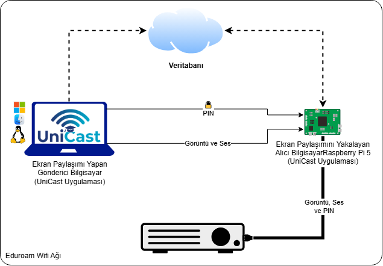

<div align="right">
  <a href="README.md">🇬🇧 English</a>
</div>

<div align="center">
  
  <h1>UniCast</h1>
  <p><strong>Eğitim için düşük gecikmeli kablosuz ekran yansıtma</strong></p>
  <p>
    <a href="https://github.com/alku-unicast/core/actions/workflows/build.yml">
      
    </a>
    
    
    <a href="https://github.com/alku-unicast/core/releases/latest">
      
    </a>
  </p>
  
</div>

---

## Hakkında

UniCast, sınıf ortamları için geliştirilmiş açık kaynaklı bir kablosuz ekran yansıtma sistemidir. Öğretmen, laptopunu bir projektöre **Wi-Fi veya kablo (LAN) üzerinden** bağlar — kablo yok, adaptör yok, sürücü kurulumu yok.

- **Gönderici:** UniCast masaüstü uygulaması (Windows / Linux / macOS) ekranı yakalar ve UDP üzerinden yayınlar
- **Alıcı:** Projektöre HDMI ile bağlı Raspberry Pi 5 görüntüyü gerçek zamanlı çözer ve ekrana yansıtır

UniCast; [Tauri](https://tauri.app/) (Rust backend + React arayüz) ve [GStreamer](https://gstreamer.freedesktop.org/) medya altyapısı üzerine inşa edilmiştir.

---

## Özellikler

| Özellik | Detay |
|---------|-------|
| **Düşük Gecikme** | LAN üzerinde uçtan uca < 150 ms |
| **Çok Platform** | Windows 10/11, Linux (X11/Wayland), macOS (Intel + Apple Silicon) |
| **Donanım Hızlandırma** | NVIDIA (NVENC), Intel (QSV), AMD (AMF), Apple (VideoToolbox), CPU yedek |
| **Ses Yayını** | UDP üzerinden Opus ses, volume kontrolü |
| **PIN Kimlik Doğrulama** | Projektör ekranında görüntülenen süreli PIN kodu |
| **Oturum Token Güvenliği** | Tüm kontrol komutları oturum token'ı gerektirir |
| **Yayın Çubuğu** | Yayın sırasında kayan her zaman üstte panel (süre, ağ kalitesi, durdur) |
| **Oda Keşfi** | Firebase tabanlı oda listesi, çevrimdışı önbellekleme |
| **Favoriler & Kat Filtresi** | Sık kullanılan odalara hızlı erişim |
| **Manuel Bağlantı** | Firebase erişilemezse doğrudan IP ile bağlan |
| **Ağ Kalitesi İzleme** | Gerçek zamanlı RTT göstergesi (mükemmel / iyi / zayıf / kötü) |

---

## İndir

> GStreamer uygulamaya dahildir — **ayrı kurulum gerekmez**.

| Platform | İndir |
|----------|-------|
| Windows 10/11 (x64) | [📦 UniCast-Setup.exe](https://github.com/alku-unicast/core/releases/download/v0.1.0/UniCast_0.1.0_x64-setup.exe) |
| Linux (x86_64 AppImage) | [📦 UniCast.AppImage](https://github.com/alku-unicast/core/releases/download/v0.1.0/UniCast_0.1.0_amd64.AppImage) |
| macOS (ARM64 / Intel) | [📦 UniCast.dmg](https://github.com/alku-unicast/core/releases/download/v0.1.0/UniCast_0.1.0_aarch64.dmg) |

Tüm sürümler: [github.com/alku-unicast/core/releases](https://github.com/alku-unicast/core/releases)

**Linux:** İndirdikten sonra çalıştırılabilir yap:
```bash
chmod +x UniCast.AppImage && ./UniCast.AppImage
```

**macOS:** Gatekeeper engellerse: sağ tıkla → Aç → Aç.

---

## Sistem Gereksinimleri

### Gönderici (Öğretmen Bilgisayarı)

| | Minimum |
|--|---------|
| İşletim Sistemi | Windows 10 (64-bit), Ubuntu 20.04+, macOS 12+ |
| RAM | 4 GB |
| GPU | Herhangi — yazılım encoder (x264) otomatik yedek |
| Ağ | Raspberry Pi ile aynı LAN |

### Alıcı (Raspberry Pi)

| | Gereksinim |
|--|------------|
| Model | Raspberry Pi 5 (önerilen), Pi 4B (destekleniyor) |
| İşletim Sistemi | Raspberry Pi OS (Bookworm veya Bullseye) |
| Bağlantı | Gönderici ile aynı ağda Ethernet veya Wi-Fi |
| Ekran | HDMI ile projektör/ekrana bağlı |

---

## Hızlı Başlangıç

### 1 — Raspberry Pi Kurulumu

Repoyu klonla ve Pi'de alıcı agent'ı başlat:

```bash
git clone https://github.com/alku-unicast/core.git
cd core
pip3 install firebase-admin
python3 src/receiver/agent.py
```

Çalıştırmadan önce Firebase servis hesabı anahtarını `src/receiver/firebase-key.json` konumuna yerleştir.  
→ Ayrıntılar için [Firebase Kurulum Rehberi](Guide/firebase_kurulum_rehberi.md)'ne bak.

Çalışınca Pi, projektör ekranında PIN kodunu gösterir.

### 2 — UniCast Uygulaması (Gönderici)

1. İşletim sistemine göre [UniCast'ı indir ve kur](#indir)
2. UniCast'ı aç — oda listesi Firebase'den otomatik yüklenir
3. Odayı (projektörü) seç, **Bağlan**'a tıkla
4. Ekranda görünen PIN'i gir
5. Yayın modunu seç (tam ekran veya pencere) ve **Yayını Başlat**'a tıkla

Yayın sırasında ekranın köşesinde yüzen bir kontrol çubuğu belirir. **Durdur**'a tıklayarak oturumu kapatabilirsin.

---

## Nasıl Çalışır?

```
Öğretmenin Laptopu                       Raspberry Pi 5
──────────────────                        ──────────────
UniCast Uygulaması (Tauri)
  │
  │  Firebase (HTTPS)          ←→        agent.py
  │  Oda keşfi                           Oda durumu & IP günceller
  │
  │  UDP:5001  PIN:<pin>       ────→     PIN doğrula
  │            OK:<token>      ←────     Oturum token'ı verildi
  │
  │  UDP:5000  RTP/H.264       ────→     Çöz → HDMI → Projektör
  │  UDP:5002  RTP/Opus        ────→     Ses çıkışı
  │
  │  UDP:5001  HEARTBEAT:<token> →       Her 2s'de canlı tutma
  │  UDP:5005  PING/PONG        ←→       RTT ölçümü
  │
  │  UDP:5001  STOP:<token>    ────→     Düzgün yayın sonu
```

**Video hattı:** GStreamer ekranı yakalar (Windows'ta D3D11, Linux'ta ximagesrc/pipewiresrc, macOS'ta avfvideosrc), donanım H.264 ile kodlar ve UDP üzerinden RTP olarak gönderir.

---

## Belgeler

| Belge | Dil |
|-------|-----|
| [GStreamer Rehberi](Guide/gstreamer_rehberi.md) | 🇹🇷 TR |
| [GStreamer Guide](Guide/gstreamer_guide.md) | 🇬🇧 EN |
| [Firebase Kurulum Rehberi](Guide/firebase_kurulum_rehberi.md) | 🇹🇷 TR |
| [Pi 5 Kurulum Rehberi](Guide/pi5_rehberi.md) | 🇹🇷 TR |
| [Pi 5 Deployment Guide](Guide/pi5_guide.md) | 🇬🇧 EN |
| [Sistem Analizi](Guide/sistem_analizi.md) | 🇹🇷 TR |
| [Performans Testi Rehberi](src/test/test_rehberi.md) | 🇹🇷 TR |
| [Geliştirme Planı](Guide/unicast_gelistirme_plani.md) | 🇹🇷 TR |

---

## Kaynak Koddan Derleme

### Gereksinimler

- [Node.js 20+](https://nodejs.org/)
- [Rust 1.77+](https://rustup.rs/)
- [Tauri CLI v2](https://tauri.app/start/prerequisites/)

GStreamer, CI/CD tarafından otomatik indirilir. Yerel geliştirme için [GStreamer Rehberi](Guide/gstreamer_rehberi.md)'ne bak.

### Derleme

```bash
git clone https://github.com/alku-unicast/core.git
cd core/app
npm install
npm run tauri build
```

Derleme çıktıları `app/src-tauri/target/release/bundle/` altında oluşur.

### Geliştirme Modu

```bash
cd core/app
npm run tauri dev
```

---

## Lisans

Bu proje **MIT Lisansı** ile lisanslanmıştır.  
Ayrıntılar için [LICENSE](LICENSE) dosyasına bak.

---

<div align="center">
  <sub>Developed at <strong>Alanya Alaaddün Keykubat Üniversitesi</strong> — Bilgisayar Mühendisliği Bölümü</sub>
  <br/>
  
</div>

